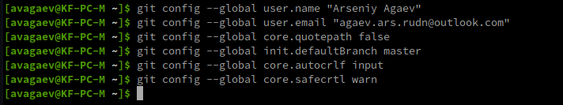

---
## Front matter
title: "Отчет"
subtitle: "Лабораторная работа №2"
author: "Арсений Валерьевич Агаев"

## Generic otions
lang: ru-RU
toc-title: "Содержание"

## Bibliography
bibliography: bib/cite.bib
csl: pandoc/csl/gost-r-7-0-5-2008-numeric.csl

## Pdf output format
toc: true # Table of contents
toc-depth: 2
lof: true # List of figures
lot: true # List of tables
fontsize: 12pt
linestretch: 1.5
papersize: a4
documentclass: scrreprt
## I18n polyglossia
polyglossia-lang:
  name: russian
  options:
	- spelling=modern
	- babelshorthands=true
polyglossia-otherlangs:
  name: english
## I18n babel
babel-lang: russian
babel-otherlangs: english
## Fonts
mainfont: PT Serif
romanfont: PT Serif
sansfont: PT Sans
monofont: PT Mono
mainfontoptions: Ligatures=TeX
romanfontoptions: Ligatures=TeX
sansfontoptions: Ligatures=TeX,Scale=MatchLowercase
monofontoptions: Scale=MatchLowercase,Scale=0.9
## Biblatex
biblatex: true
biblio-style: "gost-numeric"
biblatexoptions:
  - parentracker=true
  - backend=biber
  - hyperref=auto
  - language=auto
  - autolang=other*
  - citestyle=gost-numeric
## Pandoc-crossref LaTeX customization
figureTitle: "Рис."
tableTitle: "Таблица"
listingTitle: "Листинг"
lofTitle: "Список иллюстраций"
lotTitle: "Список таблиц"
lolTitle: "Листинги"
## Misc options
indent: true
header-includes:
  - \usepackage{indentfirst}
  - \usepackage{float} # keep figures where there are in the text
  - \floatplacement{figure}{H} # keep figures where there are in the text
---

# Цель работы

Изучить идеологию и приобрести практические навыки работы с системой *git*.

# Выполнение лабораторной работы

1. Перед началом работы непосредственно с GitHub через систему git, его необходимо
настроить. Этим я и занялся, как показано на *рис. @fig:001*.

{#fig:001 width=70%}

2. Следом, чтобы было легче и надежнее аутентифицировать мое устройство,
я создам SSH ключ, как показано на *рис. @fig:002*

{#fig:002 width=70%}

3. После создания SSH ключа, я зашел на [GitHub](https://github.com/), перешел
в настройки в раздел "SSH and GPG keys", где зарегистрировал новый ключ, нажав на
"New SSH key", как показано на *рис. @fig:003*, *рис. @fig:004* и *рис. @fig:005*.

{#fig:003 width=70%}

{#fig:004 width=70%}

{#fig:005 width=70%}

4. Далее я приступил к созданию рабочего каталога/репозитория.

	1. Для начала я создал нужные каталоги в своей домашней папке, как показано на *рис. @fig:006*.

	{#fig:006 width=70%}

	2. Т.к. у курса есть своя структура рабочего репозитория, я, используя веб-интерфейс GitHub,
	создал свой репозиторий, на основе [репозитория-шаблона](https://github.com/yamadharma/course-directory-student-template),
	как показано на *рис. @fig:007* и *рис. @fig:008*.

	{#fig:007 width=70%}

	{#fig:008 width=70%}

	3. Когда мой репозиторий был создан, я "склонировал" его на свое устройство, используя
	команду *git clone* ( *рис. @fig:009*).

	{#fig:009 width=70%}

	4. После того, как мой репозиторий был успешно развернут на моем устройстве,
	я приступил к созданию нужной структуры каталогов, удалив ненужный файл ( *рис. @fig:010*) и запустив
	скрипт для создания файлов и каталогов ( *рис. @fig:011*).

	{#fig:010 width=70%}

	{#fig:011 width=70%}

4. После того, как в локальном репозитории (на моем устройстве) была успешно создана
структура рабочего пространства, я внес эти изменения и на центральный (облачный)
репозиторий, используя команды *git add*, *git commit* и *git push*, как показано
на *рис. @fig:012* и *рис. @fig:013*.

{#fig:012 width=70%}

{#fig:013 width=70%}

5. В веб-интерфейсе GitHub можно убедиться, что изменения были внесены, что я
и наблюдаю на *рис. @fig:014*.

{#fig:014 width=70%}

6. С помощью уже ранее изученной команды mv, я перенес файлы из предыдущей лабораторной работы ( *рис. @fig:015*)
и удалил более ненужные директории ( *рис. @fig:016*).

{#fig:015 width=70%}

{#fig:016 width=70%}

# Выводы

Я узнал, как работать с системой контроля версий *git* и приобрел практические навыки
по работе с ней и платформой GitHub.
