---
## Front matter
title: "Отчет"
subtitle: "Лабораторная работа №3"
author: "Арсений Валерьевич Агаев"

## Generic otions
lang: ru-RU
toc-title: "Содержание"

## Bibliography
bibliography: bib/cite.bib
csl: pandoc/csl/gost-r-7-0-5-2008-numeric.csl

## Pdf output format
toc: true # Table of contents
toc-depth: 2
lof: true # List of figures
lot: true # List of tables
fontsize: 12pt
linestretch: 1.5
papersize: a4
documentclass: scrreprt
## I18n polyglossia
polyglossia-lang:
  name: russian
  options:
	- spelling=modern
	- babelshorthands=true
polyglossia-otherlangs:
  name: english
## I18n babel
babel-lang: russian
babel-otherlangs: english
## Fonts
mainfont: PT Serif
romanfont: PT Serif
sansfont: PT Sans
monofont: PT Mono
mainfontoptions: Ligatures=TeX
romanfontoptions: Ligatures=TeX
sansfontoptions: Ligatures=TeX,Scale=MatchLowercase
monofontoptions: Scale=MatchLowercase,Scale=0.9
## Biblatex
biblatex: true
biblio-style: "gost-numeric"
biblatexoptions:
  - parentracker=true
  - backend=biber
  - hyperref=auto
  - language=auto
  - autolang=other*
  - citestyle=gost-numeric
## Pandoc-crossref LaTeX customization
figureTitle: "Рис."
tableTitle: "Таблица"
listingTitle: "Листинг"
lofTitle: "Список иллюстраций"
lotTitle: "Список таблиц"
lolTitle: "Листинги"
## Misc options
indent: true
header-includes:
  - \usepackage{indentfirst}
  - \usepackage{float} # keep figures where there are in the text
  - \floatplacement{figure}{H} # keep figures where there are in the text
---

# Цель работы

Освоение процедуры оформления отчетов с помощью легковесного языка разметки Markdown.

# Задание

В соответствующем каталоге сделать отчет по лабораторной работе в формате 
Markdown. В качестве отчета необходимо предоставить отчеты в
3 форматах: pdf, docx, и md.

# Выполнение лабораторной работы

1. Для начала я перешел в каталог курса, созданого при выполнении предыдущей лабораторной работы (рис. @fig:001).

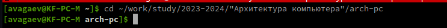{#fig:001 width=70%}

2. Далее я загрузил обновление облачного репозитория (если таковые имеются) в локальный,
используя команду *git pull* (рис. @fig:002).

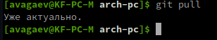{#fig:002 width=70%} 

3. После я перешел в каталог лабораторной работы №3 (рис. @fig:003).

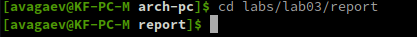{#fig:003 width=70%}

4. Теперь я решил посмотреть на работу шаблона и сгенерировал его с использованием Makefile
посредством команды *make* (рис. @fig:004).

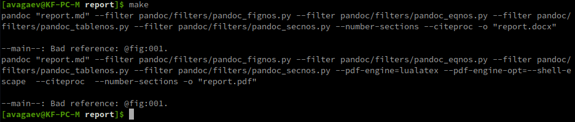{#fig:004 width=70%}

5. После исследования полученных файлов, я удалил их  командой *make clear* (рис. @fig:005).

	1. Проверил удаление командой *ls* (рис. @fig:006). 

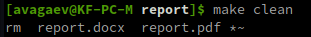{#fig:005 width=70%} 

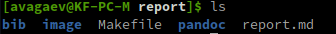{#fig:006 width=70%}

6. Используя текстовый редактор *nano*, я открыл файл report.md (рис. @fig:007)

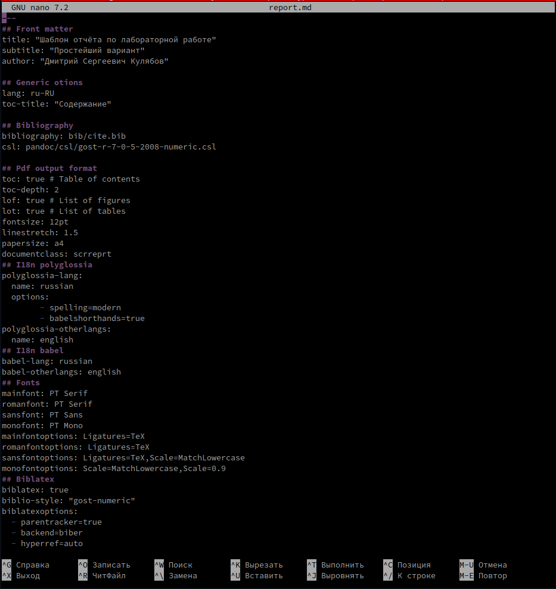{#fig:007 width=70%}

7. Изуча шаблон отчета, я заполнил его данными о проведенной работе (рис. @fig:008).

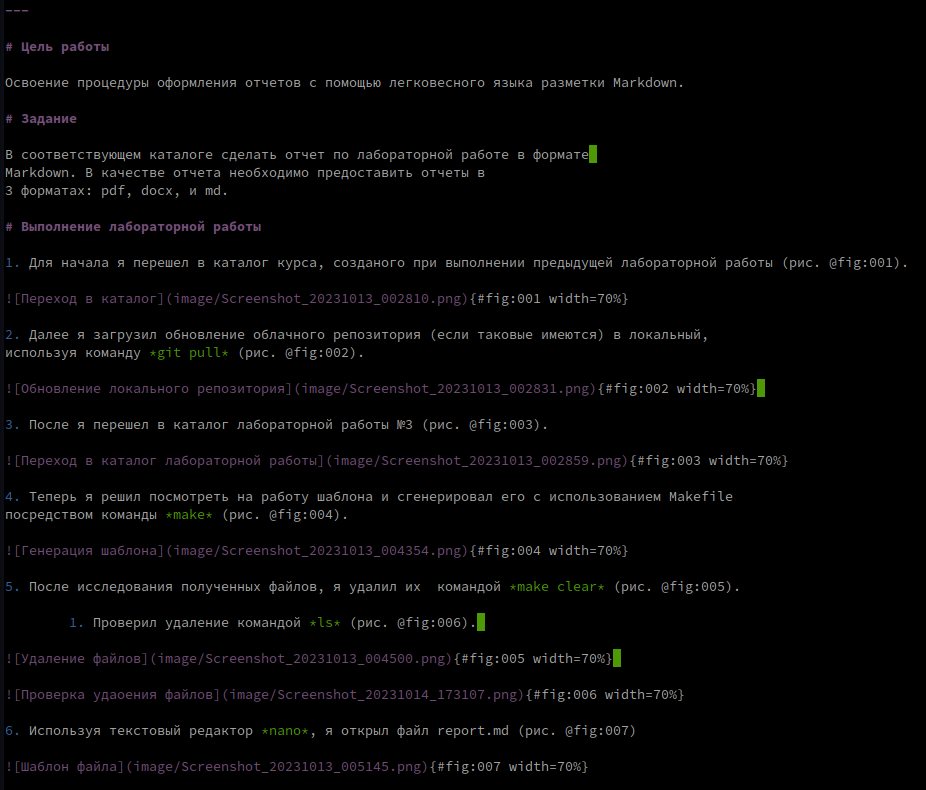{#fig:008 width=70%}

8. Далее я начал выполнение задания. Для начала я перешел в каталог 2 лабараторной работы (рис. @fig:009).

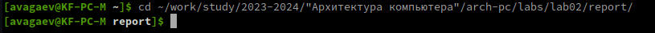{#fig:009 width=70%}

9. С помощью текстового редактора *nano*, я открыл report.md (рис. @fig:010).

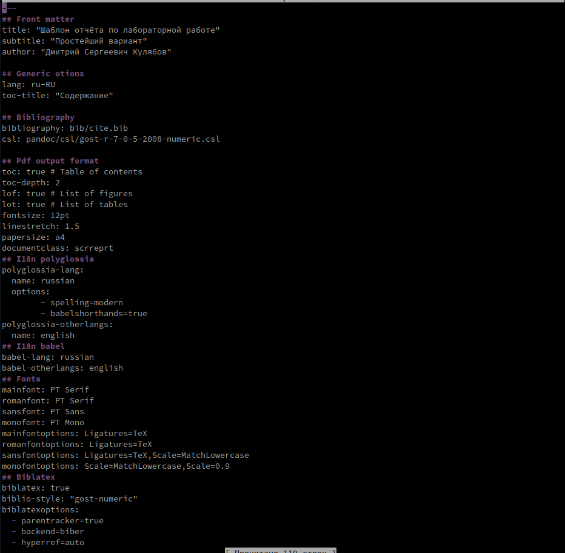{#fig:010 width=70%}

10. Отредактировал файл report.md, заполнив отчет по лабораторной работе №2 (рис. @fig:011).

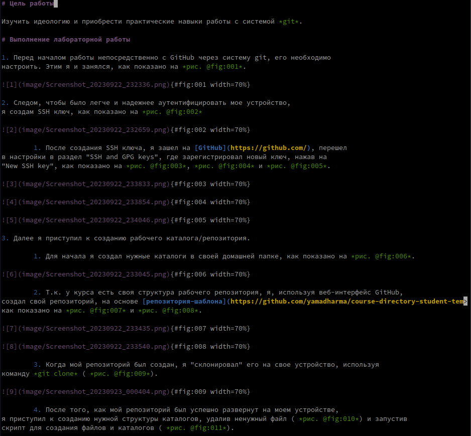{#fig:011 width=70%}

11. С помощью Makefile и команды *make*, создал файлы report.docx и report.pdf, на основе report.md (рис. @fig:012).

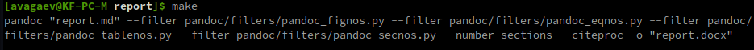{#fig:012 width=70%}

12. Проверил, что файлы были успешно созданы, используя команду *ls* (рис. @fig:013).

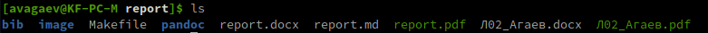{#fig:013 width=70%}

# Выводы

Я познакомился с языком разметки Markdown и освоил процедуры оформления отчетов с его помощью.
