---
## Front matter
title: "Отчет"
subtitle: "Лабораторная работа №4"
author: "Арсений Валерьевич Агаев"

## Generic otions
lang: ru-RU
toc-title: "Содержание"

## Bibliography
bibliography: bib/cite.bib
csl: pandoc/csl/gost-r-7-0-5-2008-numeric.csl

## Pdf output format
toc: true # Table of contents
toc-depth: 2
lof: true # List of figures
lot: true # List of tables
fontsize: 12pt
linestretch: 1.5
papersize: a4
documentclass: scrreprt
## I18n polyglossia
polyglossia-lang:
  name: russian
  options:
	- spelling=modern
	- babelshorthands=true
polyglossia-otherlangs:
  name: english
## I18n babel
babel-lang: russian
babel-otherlangs: english
## Fonts
mainfont: PT Serif
romanfont: PT Serif
sansfont: PT Sans
monofont: PT Mono
mainfontoptions: Ligatures=TeX
romanfontoptions: Ligatures=TeX
sansfontoptions: Ligatures=TeX,Scale=MatchLowercase
monofontoptions: Scale=MatchLowercase,Scale=0.9
## Biblatex
biblatex: true
biblio-style: "gost-numeric"
biblatexoptions:
  - parentracker=true
  - backend=biber
  - hyperref=auto
  - language=auto
  - autolang=other*
  - citestyle=gost-numeric
## Pandoc-crossref LaTeX customization
figureTitle: "Рис."
tableTitle: "Таблица"
listingTitle: "Листинг"
lofTitle: "Список иллюстраций"
lotTitle: "Список таблиц"
lolTitle: "Листинги"
## Misc options
indent: true
header-includes:
  - \usepackage{indentfirst}
  - \usepackage{float} # keep figures where there are in the text
  - \floatplacement{figure}{H} # keep figures where there are in the text
---

# Цель работы

Освоить процедуры компиляции и сборки программ, написанных на ассемблере NASM.

# Задание

Создать программу на ассемблере, которая выводит мои имя и фамилию.

# Выполнение лабораторной работы

1. Для начала, я создал новый каталог "lab04" для работы с программами на языке ассемблера NASM,
перешел в данный каталог и создал файл "hello.asm" (рис. @fig:001 и рис. @fig:002).

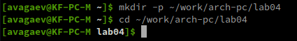{#fig:001 width=70%}

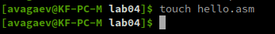{#fig:002 width=70%}

2. После с помощью тектового редактора *nano* я открыл файл "hello.asm" и написал код для
выводы строки "Hello world!" (рис. @fig:003 и рис. @fig:004).

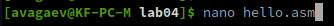{#fig:003 width=70%}

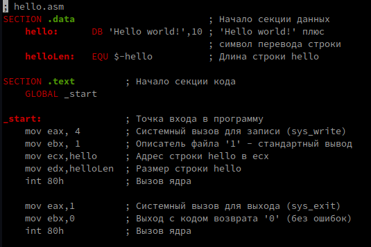{#fig:004 width=70%}

3. Далее я провел компиляцию своего кода в объектный код с помощью NASM. С помощью
команды *ls* проверил успешное создание файла с объектным кодом "hello.o" (рис. @fig:005).

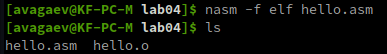{#fig:005 width=70%}

4. У NASM довольно обширный список опций, который я решил проверить (рис. @fig:006).

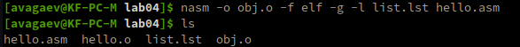{#fig:006 width=70%}

5. После получения файла с объектным кодом, его необходимо обработать компоновщиком для
получения исполняемого файла (рис. @fig:007).

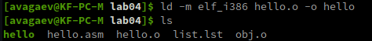{#fig:007 width=70%}

6. По аналогии с  NASM, я также проверил работу опций у компоновщика LD (рис. @fig:008).

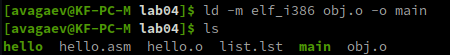{#fig:008 width=70%}

7. Наконец, я проверил работу самого исполняемого файла "hello" (рис. @fig:009).

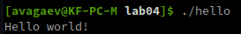{#fig:009 width=70%}

8. После изучения алгоритма по созданию прогрммы на ассемблере NASM, я принялся
за выполнение самотоятельной работы. Для начала, я сделал копию файла "hello.asm",
с которой в последствии и буду работать (рис. @fig:010).

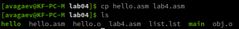{#fig:010 width=70%}

9. Как и ранее, я открыл файл "lab4.asm" с помощью т.р. *nano* и внес изменения
в код файла "hello.asm" для вывода своих имени и фамилии (рис. @fig:011).

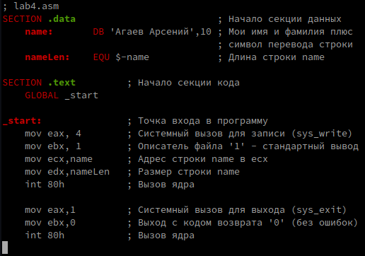{#fig:011 width=70%}

10. Далее повторил компиляцию и компоновку, как в пунктах 3 и 5 (рис. @fig:012 и рис. @fig:013).
После проверил работу исполняемого файла "lab4" (рис. @fig:014).

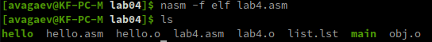{#fig:012 width=70%}

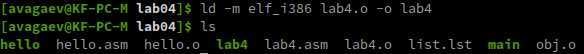{#fig:013 width=70%}

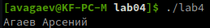{#fig:014 width=70%}

11. После успешной проверки корректной работоспособности программы, я скопировал
файлы "hello.asm" и "lab4.asm" в мой локальный репозиторий (рис. @fig:015).

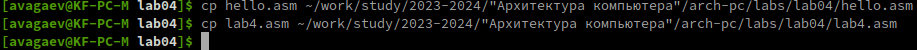{#fig:015 width=70%}

# Выводы

Я познакомился и освоил процедуры компиляции и сборки программ, написанных на ассемблере NASM.
